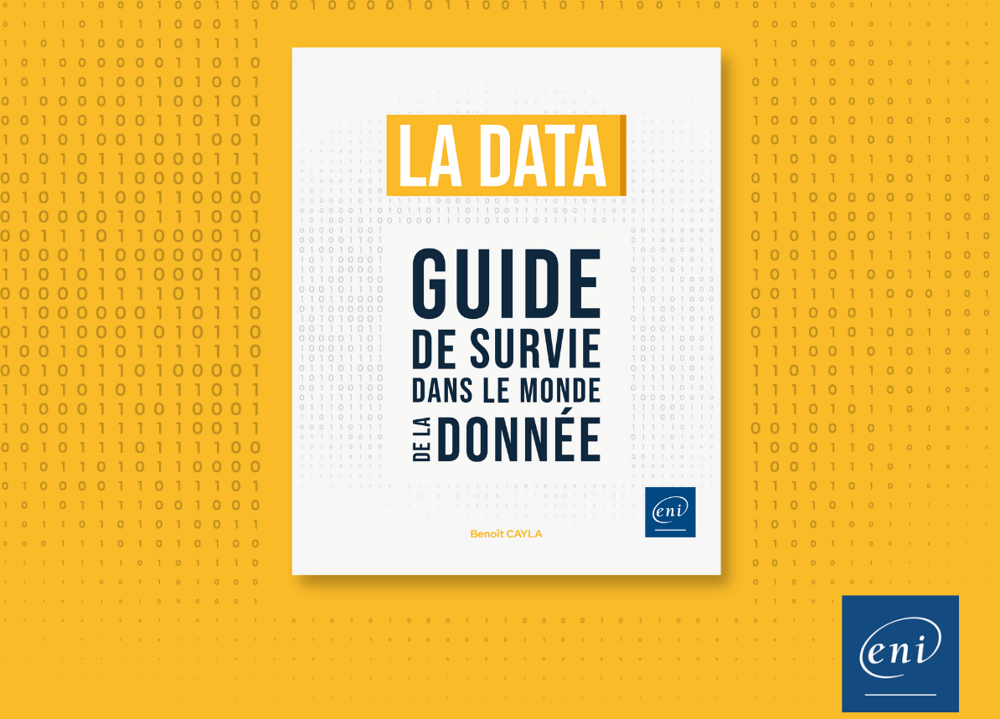

Voici les liens et références du [livre](https://www.editions-eni.fr/livre/la-data-guide-de-survie-dans-le-monde-de-la-donnee-9782409037160) pour aller plus loin ...  
**Retrouvez plus encore sur [datacorner.fr](https://datacorner.fr/)**

# Chapitre 1 : La donnée sous toutes ses facettes
## Liens
* [Une donnée (Wikipédia)](https://fr.wikipedia.org/wiki/Donn%C3%A9e_(informatique))  
* [Bagage minimal de statistiques pour le Machine learning](https://datacorner.fr/statistiques-min/)  
* [Gérer les chaînes de caractères](https://datacorner.fr/strings/)  
* [Qu’est-ce qu’une donnée (INSEE)](https://www.insee.fr/fr/information/5008707)  
* [La donnée (Larousse)](https://www.larousse.fr/dictionnaires/francais/donn%C3%A9e/26436)  
* [Les données personnelles (CNIL)](https://www.cnil.fr/fr/definition/donnee-personnelle)  
* [Les données sensibles (CNIL)](https://www.cnil.fr/fr/definition/donnee-sensible)  
* [Le traitement d'image](https://datacorner.fr/image-processing/)  

## Exemples du livres
* [Statistiques de base avec Python](https://github.com/datacorner/ladata/blob/main/La%20data%20-%20Chap%201%20-%20La%20donn%C3%A9e%20sous%20toutes%20ses%20facettes.ipynb) 

# Chapitre 2 : la persistence
## Ouvrages
* [SQL Les fondamentaux du langage - 4e édition (Editions ENI)](https://www.editions-eni.fr/livre/sql-les-fondamentaux-du-langage-avec-exercices-et-corriges-4e-edition-9782409026553)  
* [Hadoop Devenez opérationnel dans le monde du Big Data (Editions ENI)](https://www.editions-eni.fr/livre/hadoop-devenez-operationnel-dans-le-monde-du-big-data-9782409007613/hadoop)  
* [Modélisation décisionnelle](https://www.editions-eni.fr/livre/modelisation-decisionnelle-concevoir-la-base-de-donnees-pour-les-traitements-olap-9782409007934)  
## Liens
* [Merise - Guide pratique - 3e édition (Editions ENI)](https://www.editions-eni.fr/livre/merise-guide-pratique-3e-edition-modelisation-des-donnees-et-des-traitements-manipulations-avec-le-langage-sql-9782409015342)  
* [Théorème CAP (Wikipédia)](https://fr.wikipedia.org/wiki/Th%C3%A9or%C3%A8me_CAP)  
* [ACID : les 4 propriétés des transactions de bases de données (lebigdata.fr)](https://www.lebigdata.fr/acid-base-de-donnees-definition)  
* [Les Contraintes d’intégrité référentielles - CIT (Wikipédia)](https://fr.wikipedia.org/wiki/Int%C3%A9grit%C3%A9_r%C3%A9f%C3%A9rentielle)  
* [Gartner’s Original "Volume-Velocity-Variety" Definition of Big Data](https://community.aiim.org/blogs/doug-laney/2012/08/25/deja-vvvu-gartners-original-volume-velocity-variety-definition-of-big-data)

# Chapitre 3 : L'intégration de données
## Ouvrages
* [Talend Open Studio (Editions ENI)](https://www.editions-eni.fr/livre/talend-open-studio-le-guide-complet-pour-l-integration-de-donnees-9782409040481)  
* [Azure Data Factory (Editions ENI)](https://www.editions-eni.fr/livre/azure-data-factory-integrez-vos-donnees-avec-le-service-serverless-d-azure-9782409021183)  
## Liens
* [Data Virtualization (Anglais) - Wikipédia](https://en.wikipedia.org/wiki/Data_virtualization)  
* [ETL (Wikipédia)](https://fr.wikipedia.org/wiki/Extract-transform-load)  
* [ELT (Wikipédia)](https://fr.wikipedia.org/wiki/Extract_load_transform)  
* [Qu’est-ce qu’un pipeline de données ?](https://aws.amazon.com/fr/what-is/data-pipeline/)  
* [Les bus de données (Wikipédia)](https://fr.wikipedia.org/wiki/Bus_de_donn%C3%A9es)  

# Chapitre 4 : Analyser et fiabiliser les données
## Ouvrages
* [Datavisualisation et tableaux de bord interactifs avec Tableau Desktop (Editions ENI)](https://www.editions-eni.fr/livre/datavisualisation-et-tableaux-de-bord-interactifs-avec-tableau-desktop-9782409011320)  
* [Python pour la Data Science - Analysez vos données avec NumPy, Pandas, Matplotlib et Seaborn (Editions ENI) ](https://www.editions-eni.fr/livre/python-pour-la-data-science-analysez-vos-donnees-avec-numpy-pandas-matplotlib-et-seaborn-livre-avec-complement-video-visualisation-de-donnees-9782409039300)  
* [Power BI Desktop (Editions ENI)](https://www.editions-eni.fr/livre/power-bi-desktop-renforcer-approfondir-explorer-9782409026768)  
## Liens
* [Principes de la Gestalt](https://datastudiofr.com/les-6-principes-de-la-gestalt/)  
* [Psychologie de la forme (Wikipédia)](https://fr.wikipedia.org/wiki/Psychologie_de_la_forme)  
* [Le profilage de données (Wikipédia)](https://fr.wikipedia.org/wiki/Data_profiling)  
* [La qualité de données (Wikipédia)](https://fr.wikipedia.org/wiki/Qualit%C3%A9_des_donn%C3%A9es)  
## Exemples du livres
* [Exemples avec Python](https://github.com/datacorner/ladata/blob/main/La%20data%20-%20Chap%204%20-%20Analyser%20et%20fiabiliser%20les%20donn%C3%A9es.ipynb) 

# Chapitre 5 : Gérer le cycle de vie des données
## Liens
* [Le Lignage de données (Wikipédia)]( https://fr.wikipedia.org/wiki/Data_Lineage)  
* [Le data lineage, un levier important d’efficacité opérationnelle et de réduction des risques (Deloitte)]( https://www2.deloitte.com/fr/fr/pages/risque-compliance-et-controle-interne/articles/data-lineage-reduction-risques-efficacite-operationnelle.html)  
* [Le Data Ops (Wikipédia)]( https://fr.wikipedia.org/wiki/DataOps)  
* [Data Gouvernance ou Gouvernance des Données : définition et enjeux]( https://datascientest.com/data-gouvernance-definition)  
* [Les métadonnées (Wikipédia)]( https://fr.wikipedia.org/wiki/M%C3%A9tadonn%C3%A9e)  

# Chapitre 6 : Valoriser ses données avec l'IA
## Ouvrages
* [Intelligence artificielle (Editions ENI)](https://www.editions-eni.fr/livre/intelligence-artificielle-enjeux-ethiques-et-juridiques-9782409031342)  
* [Intelligence artificielle vulgarisée (Editions ENI)](https://www.editions-eni.fr/livre/intelligence-artificielle-vulgarisee-le-machine-learning-et-le-deep-learning-par-la-pratique-9782409020735)  
* [Machine Learning et Deep Learning (Editions ENI)](https://www.editions-eni.fr/livre/machine-learning-et-deep-learning-des-bases-a-la-conception-avancee-d-algorithmes-exemples-en-python-et-en-javascript-9782409027604)  
* [Machine Learning - Implémentation en Python avec Scikit-learn (Editions ENI)](https://www.editions-eni.fr/livre/machine-learning-implementation-en-python-avec-scikit-learn-9782409032516)  
* [L'Intelligence Artificielle pour les développeurs (Editions ENI)](https://www.editions-eni.fr/livre/l-intelligence-artificielle-pour-les-developpeurs-concepts-et-implementations-en-java-2e-edition-9782409017094)  
## Liens
* [Biais ou variance](https://datacorner.fr/biais-variance/)  
* [Natural Language Processing (NLP) : Définition et principes](https://datascientest.com/introduction-au-nlp-natural-language-processing)  
* [Analyse de sentiments sur des critiques de cinéma](https://datacorner.fr/sentiment-analysis/)  
* [Comprendre les réseaux de neurones](https://larevueia.fr/comprendre-les-reseaux-de-neurones/)  
* [Découvrir les LLM](https://datacorner.fr/llm-hf-lc/)  
* [NLP : guide complet du traitement du langage naturel](https://intelligence-artificielle.com/nlp-guide-complet/)  
* [La descente de gradient](https://datacorner.fr/gradient-descent/)  

# Chapitre 7 : Les grandes solutions de gestion de données
## Liens
* [La Gestion des données de référence (Wikipédia)](https://fr.wikipedia.org/wiki/Gestion_des_donn%C3%A9es_de_r%C3%A9f%C3%A9rence)  
* [L'Entrepôt de données (Wikipédia)](https://fr.wikipedia.org/wiki/Entrep%C3%B4t_de_donn%C3%A9es)  
* [Delta Lake : tout savoir sur la solution Data Lake du créateur de Spark](https://www.lebigdata.fr/delta-lake-tout-savoir)  
* [Le Lac de données (Wikipédia)](https://fr.wikipedia.org/wiki/Lac_de_donn%C3%A9es)  
* [Data Hub définition : tout savoir sur les hubs de données](https://www.lebigdata.fr/data-hub-definition)  
